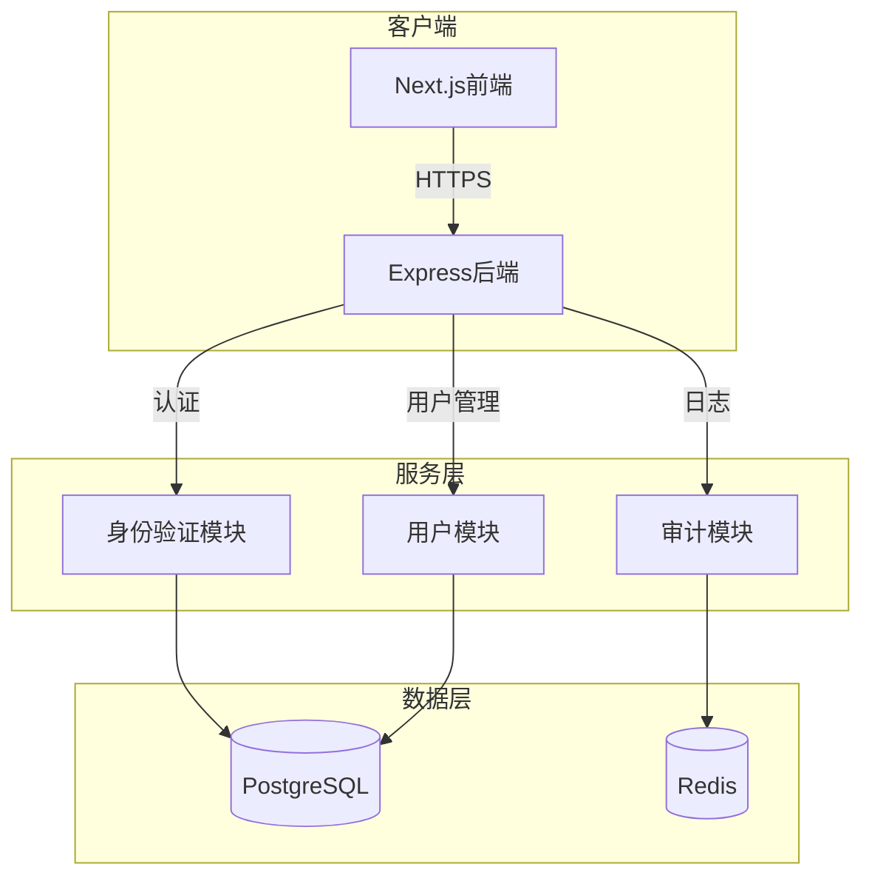

# 身份鉴别系统设计方案

## 1. 系统概述
### 1.1 核心功能
- 双因素认证（密码 + 人脸识别）
- 用户管理
- 安全审计

### 1.2 技术栈选择
- 前端：Next.js 14 + shadcn/ui + TypeScript
- 后端：Express.js + TypeScript
- 数据库：PostgreSQL + Redis
- 部署：Docker + Docker Compose

## 2. 系统架构
### 2.1 项目结构
```
identity-auth/
├── apps/
│   ├── web/                      # Next.js 前端
│   │   ├── app/                 
│   │   │   ├── page.tsx        # 首页
│   │   │   ├── auth/          # 认证页面
│   │   │   └── dashboard/     # 用户面板
│   │   ├── components/         
│   │   │   ├── ui/           # shadcn组件
│   │   │   └── auth/         # 认证组件
│   │   └── lib/               
│   │       ├── face-api.ts    # 人脸识别
│   │       └── auth.ts        # 认证工具
│   │
│   └── server/                  # Express 后端
│       ├── src/
│       │   ├── config/         # 配置文件
│       │   ├── controllers/    # 控制器
│       │   ├── middlewares/    # 中间件
│       │   ├── models/         # 数据模型
│       │   ├── routes/         # 路由
│       │   ├── services/       # 业务逻辑
│       │   ├── utils/          # 工具函数
│       │   └── app.ts          # 入口
│       └── tests/              # 测试文件
│
└── packages/
    └── shared/                 # 共享代码
```

### 2.2 架构图与数据流


## 3. 核心模块实现
### 3.1 认证流程
```typescript
// apps/server/src/services/auth.ts
class AuthService {
  async verify(credentials: AuthCredentials): Promise<AuthResult> {
    // 1. 密码验证
    const passwordValid = await this.verifyPassword(
      credentials.password,
      user.passwordHash
    );

    // 2. 人脸特征比对
    const faceValid = await this.verifyFace(
      credentials.faceData,
      user.faceFeatures
    );

    return this.calculateAuthScore({
      passwordValid: passwordValid ? 0.5 : 0,
      faceValid: faceValid ? 0.5 : 0
    });
  }
}
```

### 3.2 人脸识别实现
```typescript
// apps/web/lib/face-recognition.ts
import * as faceapi from 'face-api.js';

export class FaceCapture {
  static async setup() {
    await faceapi.nets.faceLandmark68Net.loadFromUri('/models');
    await faceapi.nets.faceRecognitionNet.loadFromUri('/models');
  }

  static async capture(): Promise<Float32Array> {
    const stream = await navigator.mediaDevices.getUserMedia({ video: true });
    return await this.detectFace(stream);
  }
}
```

## 4. 性能与安全指标
### 4.1 性能指标
- API响应时间 < 300ms
- 人脸识别时间 < 1s
- 并发支持：200 QPS
- 数据库查询 < 50ms
- Redis缓存命中率 > 90%

### 4.2 安全指标
- 人脸识别准确率 > 95%
- 误识率 < 1%
- 密码加密：bcrypt
- 特征存储：AES-256
- 通信加密：HTTPS/TLS 1.3
- 登录限制：5次/小时

## 5. 部署配置
### 5.1 一键部署脚本
```bash
# run.sh
#!/bin/bash
set -e  # 遇到错误立即退出

echo "🚀 Starting deployment..."

# 1. 检查必要的工具
command -v docker >/dev/null 2>&1 || { echo "❌ Docker is required but not installed. Aborting." >&2; exit 1; }
command -v docker-compose >/dev/null 2>&1 || { echo "❌ Docker Compose is required but not installed. Aborting." >&2; exit 1; }
command -v pnpm >/dev/null 2>&1 || { echo "❌ pnpm is required but not installed. Aborting." >&2; exit 1; }

# 2. 安装依赖
echo "📦 Installing dependencies..."
pnpm install

# 3. 构建应用
echo "🔨 Building application..."
pnpm build

# 4. 启动Docker服务
echo "🐳 Starting Docker services..."
docker-compose up --build -d

# 5. 等待服务就绪
echo "⏳ Waiting for services to be ready..."
sleep 10

# 6. 健康检查
echo "🔍 Performing health check..."
curl -f http://localhost:3000/api/health || { 
    echo "❌ Health check failed. Check logs with: docker-compose logs"
    exit 1
}

echo "✅ Deployment completed successfully!"
echo "🌍 Application is running at http://localhost:3000"
```

### 5.2 Docker配置
```dockerfile
# Dockerfile
FROM node:18-slim

# 安装pnpm
RUN npm install -g pnpm

WORKDIR /app

# 复制package.json和pnpm-lock.yaml
COPY package.json pnpm-lock.yaml ./
COPY packages/shared/package.json ./packages/shared/
COPY apps/web/package.json ./apps/web/
COPY apps/server/package.json ./apps/server/

# 安装依赖
RUN pnpm install

# 复制源代码
COPY . .

# 构建应用
RUN pnpm build

EXPOSE 3000

CMD ["pnpm", "start"]
```

### 5.3 容器编排
```yaml
# docker-compose.yml
version: '3.8'
services:
  app:
    build: .
    ports:
      - "3000:3000"
    environment:
      - NODE_ENV=production
      - DATABASE_URL=postgresql://auth:secret@db:5432/authdb
      - REDIS_URL=redis://redis:6379
      - JWT_SECRET=your-secret-key
    depends_on:
      - db
      - redis
    healthcheck:
      test: ["CMD", "curl", "-f", "http://localhost:3000/api/health"]
      interval: 30s
      timeout: 10s
      retries: 3

  db:
    image: postgres:latest
    environment:
      POSTGRES_DB: authdb
      POSTGRES_USER: auth
      POSTGRES_PASSWORD: secret
    volumes:
      - pgdata:/var/lib/postgresql/data
    healthcheck:
      test: ["CMD-SHELL", "pg_isready -U auth -d authdb"]
      interval: 10s
      timeout: 5s
      retries: 5

  redis:
    image: redis:latest
    volumes:
      - redisdata:/data
    healthcheck:
      test: ["CMD", "redis-cli", "ping"]
      interval: 10s
      timeout: 5s
      retries: 5

volumes:
  pgdata:
  redisdata:
```

### 5.4 使用说明
1. **环境要求**：
   - Docker
   - Docker Compose
   - pnpm

2. **部署步骤**：
   ```bash
   # 1. 克隆项目
   git clone <repository-url>
   cd identity-auth

   # 2. 添加执行权限
   chmod +x run.sh

   # 3. 执行部署脚本
   ./run.sh
   ```

3. **验证部署**：
   - 访问 http://localhost:3000 查看前端页面
   - 访问 http://localhost:3000/api/health 检查后端状态

4. **查看日志**：
   ```bash
   # 查看所有服务日志
   docker-compose logs -f

   # 查看特定服务日志
   docker-compose logs -f app
   ```

5. **停止服务**：
   ```bash
   docker-compose down
   ```

## 6. 核心要求实现说明
1. **正确识别最大化**：
   - 双因素认证
   - 可配置阈值
   - 高精度人脸识别

2. **不可传递性**：
   - 实时人脸采集
   - 活体检测

3. **防欺骗**：
   - 密码加密存储
   - 特征向量加密
   - 访问频率限制

4. **计算效率**：
   - 服务端渲染
   - 缓存优化
   - 数据库索引

5. **通信效率**：
   - HTTPS加密
   - 数据压缩
   - 连接池

6. **安全存储**：
   - 加密算法
   - 数据备份
   - 密钥管理